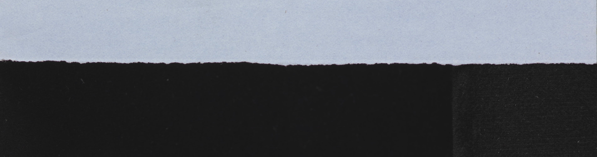

# tear-shape-compare
Module to compare the shapes of tears, to match torn pieces of paper to one another

This is a conceptual module meant to tackle a specific problem, and to be used as a starting point for that problem.

The module is meant to allow easy comparison between torn pieces of paper. The goal is to match the paper tear marks to the notebook tear marks, or to the tear marks of another piece of paper, for the sake of matching halves of a paper together or matching torn notes out of a notebook to the right notebook.

The class turns pictures of paper tears into identity vectors, and can be used to make a database out of them and to find matches.
The class can be used for:
1) Creating a database of vectors from a database of pictures of tears
2) Comparing all vectors in the database to find closest matches
3) Comparing only a new individual image of a tear to already existing database
4) Saving database to file and loading it from file
5) Saving all found matches to file

All saved files are python dictionaries saved through pickle.

All images fed to the module must already be pre-processed to a minor degree (cropped & perspective warped for ideal results), and should look more or less like this:

The module will further process the image to extract the tears' peaks and valleys and turn those into an identity vector, which can be compared with other vectors representing other tears.
